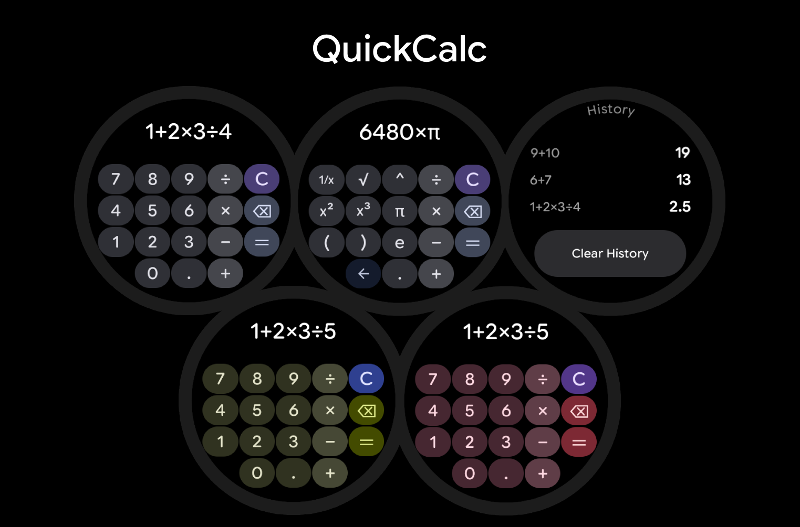
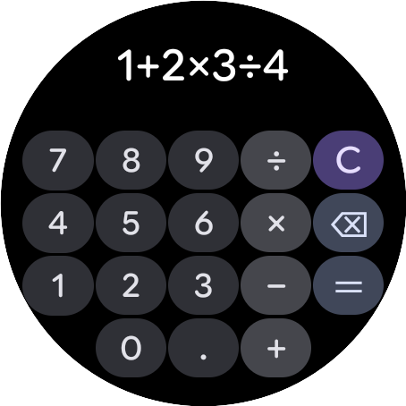
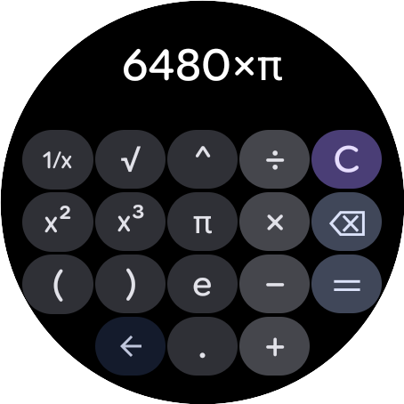
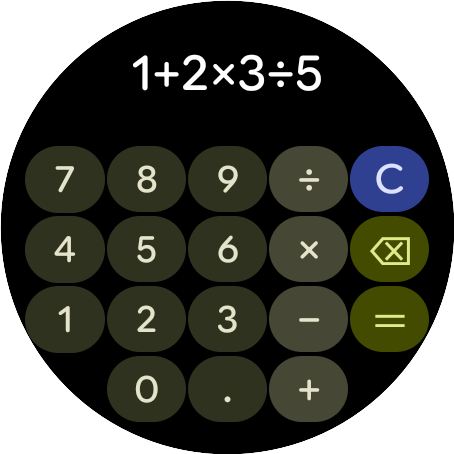
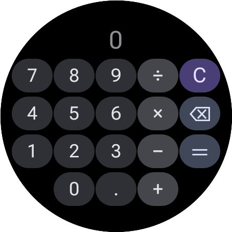

# QuickCalc

QuickCalc is a simple, elegant, and efficient calculator app designed specifically for WearOS. Originally created for the Pixel Watch 2, it matches modern Material Design guidelines and features a clean round design that is optimized for wearables.

## Features

- **Material You Dynamic Coloring**: Integrates with WearOS 3+ system colors to dynamically match your active theme (with a beautiful fallback dark theme for older devices).
- **Dual Layout (Standard & Scientific)**: Easily swipe between a standard calculator page and a scientific page featuring functions like `1/x`, `√`, `^`, powers, `π`, `e`, and parentheses.
- **Rotary Scroll & Calculation History**: Scroll using the rotary crown (or swipe down) to review your calculation history and clear it with a single tap.
- **Wear OS Tile**: Quick calculation access directly from your watch's tiles.
- **Watch Face Complications**: Launch QuickCalc directly from your watch face using either monochromatic or launcher icon complications.

## Screenshots

| Main Interface | Scientific Layout |
| :---: | :---: |
|  |  |

| Dynamic Theme | Wear OS Tile |
| :---: | :---: |
|  |  |

## Installation

### Get it on Google Play
Install directly onto your WearOS device via the Google Play Store:

### Manual Installation (Alternative)

1. Download the latest release from the [releases page](releases)
2. Activate Developer Mode on your watch (click on the build number 7 times)
3. Enable Wireless Debugging in Developer Options
4. Use ADB on your computer to Pair and Connect to your watch via Wireless Debugging. Official instructions on that [here](https://developer.android.com/training/wearables/get-started/debugging)
5. Once connected, type `adb install <path to QuickCalc.apk>`
